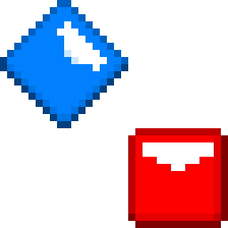

# Beat Saber Map Check

A small project to bring extensive overview of maps,
aimed to reduce error before modding & release.

by **Kival Evan#5480**

## How to use

Visit the [github.io page](https://kivalevan.github.io/BeatSaber-MapCheck/), more information in the [GitHub Wiki](https://github.com/KivalEvan/BeatSaber-MapCheck/wiki).

## Development

### Installing

Clone or fork the project and install dependencies with `yarn`.

### Deploying

Run the development server with `yarn run dev`, the URL will be given in the CLI.

To run the app locally, `yarn run build` for the first time setup, then `yarn run serve` to run the server.

## Planned

-   Rewrite swing detection
-   Save tools parameter

## Note

Since this is my first ever (web) project, I'm open to feedback to further improve skill and develop better stuff in the future. If you have any suggestion or feedback, let me know on Discord@Kival Evan#5480
